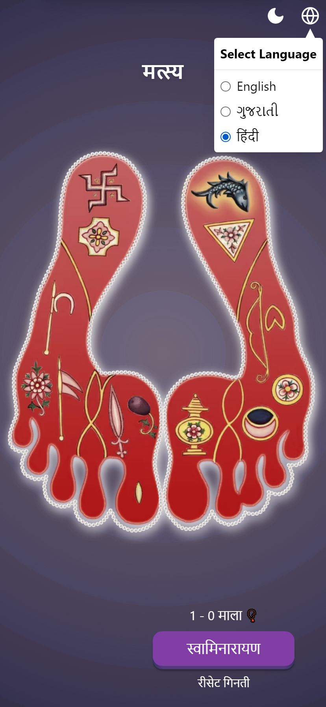
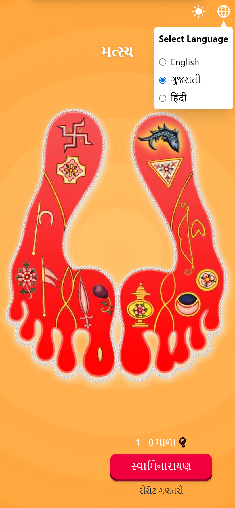

# 16 Chinha App

This app is a meditation tool for devotees of Lord Swaminarayan. It helps devotees focus on the sixteen divine symbols present in pious feet of Lord Swaminarayan.

 

## Features

- Light/Dark Mode.
- English, Gujarati, Hindi language support.

 

## Tech stack

- HTML, Custom CSS + [TailwindCSS](https://tailwindcss.com), and Vanilla JS
- Bundling: [Vite](https://vitejs.dev)
- PWA: [vite-plugin-pwa](https://vite-pwa-org.netlify.app)

 

## Screenshots

### App Preview

 

### Counter

 

### Dark Mode

 

### Language Selection

 

### App in Hindi

 

### App in Gujarati
